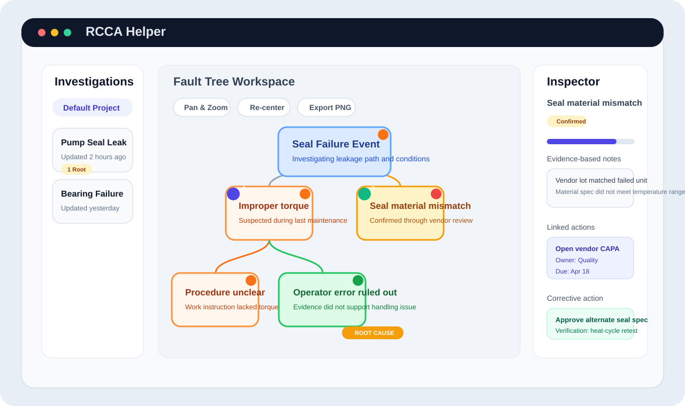
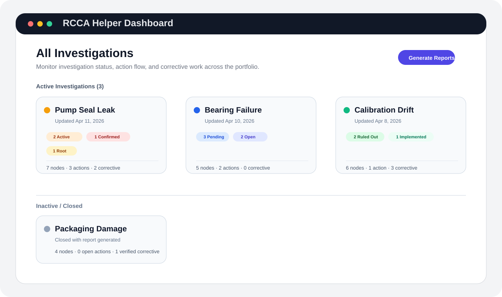
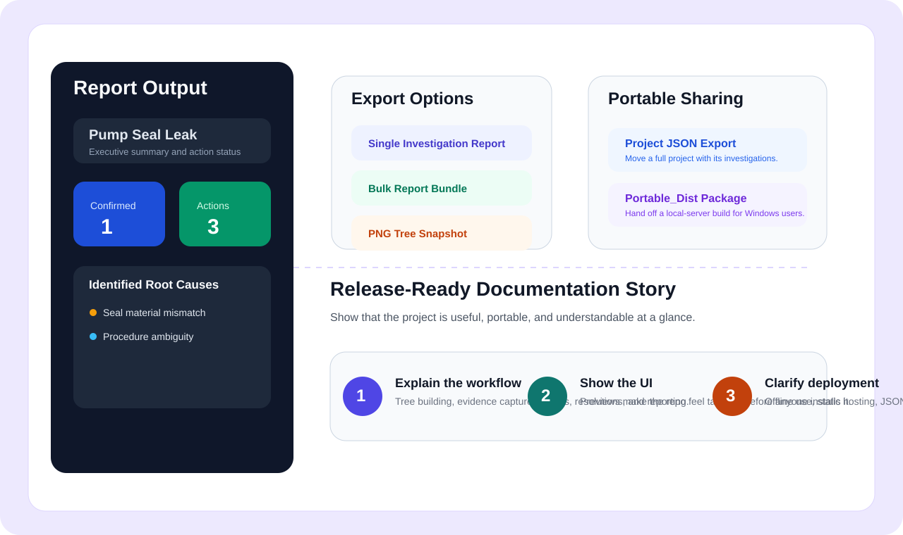

# RCCA Helper

Root Cause Corrective Action workspace for facilitator-led investigations, fault tree analysis, and action tracking.

Built with React, TypeScript, and D3. Runs fully offline in the browser on macOS and Windows, with local persistence and JSON-based export/import for sharing or backup.


## Why This Project Exists

Many RCA tools are either too generic, too heavyweight, or too dependent on cloud systems for teams that need a practical investigation workspace during live sessions. RCCA Helper is designed to stay focused on the actual investigation flow:

- map causes visually in a fault tree
- capture evidence and rationale at the node level
- track investigation actions and corrective actions in the same workspace
- generate reports without moving data into another tool
- keep data local for teams working in restricted or offline environments

## Product Snapshot

| Investigation Workspace | Portfolio Dashboard |
| --- | --- |
|  |  |
| Interactive fault tree with status-aware nodes, action markers, and corrective-action indicators. | Scan active investigations, status mix, root-cause coverage, and reporting progress across projects. |

| Reporting And Portability | |
| --- | --- |
|  | Generate HTML reports, export JSON project bundles, and launch the checked-in build directly on Windows or macOS. |

These are lightweight UI previews included for GitHub presentation. The live app includes the full interactive experience.

## Core Capabilities

- Interactive D3 fault tree visualization with pan, zoom, recentering, and PNG export
- Node-level investigation workflow with `Pending`, `Active`, `Ruled Out`, and `Confirmed` statuses
- Root-cause marking so confirmed causes can roll into resolution planning
- Evidence-based notes and rationale capture directly on investigation nodes
- RAIL-style investigation action tracking with assignees, dates, and progress updates
- Corrective action and resolution tracking linked back to identified root causes
- Multi-project and multi-investigation organization in one local workspace
- Dashboard summaries for active versus inactive investigations
- HTML report generation for single investigations or bulk report output
- JSON import/export for investigations and project bundles
- Local persistence with optional auto-backup support
- Light/dark theme support for different working environments

## Investigation Workflow

1. Create or import a project.
2. Build out the fault tree during the investigation session.
3. Mark causes as ruled out, active, confirmed, or explicit root causes as evidence develops.
4. Attach investigation actions and corrective actions to the relevant causes.
5. Export project data, PNG tree views, or generated reports for circulation and recordkeeping.

## Run Locally

### Double-Click Launchers

If you just want to run the built app without Node.js, npm, or a dev server:

- On Windows, double-click `Run RCCA Helper.bat`
- On macOS, double-click `Run RCCA Helper.command`

These start a tiny local server for the checked-in `dist/` folder and then open the app in your browser.

On macOS, you may need to right-click `Run RCCA Helper.command` and choose `Open` the first time so Gatekeeper allows it.

### Prerequisites

- Node.js 20+ recommended
- npm

### Development

```bash
npm install
npm run dev
```

Open [http://localhost:3000](http://localhost:3000).

### Production Build

```bash
npm run build
npm run preview
```

The production site is emitted to `dist/` as static assets, and that is what the double-click launchers open.
Keep the launcher window open while using the app, since it is hosting the local server.

If you change the source code, run `npm run build` again so the checked-in `dist/` stays current.

## Data, Privacy, And Deployment

- The app is designed for offline/local use.
- State is stored in the browser via `localStorage`.
- Exports are plain JSON files for investigations or full projects.
- Production output is static and can be hosted on GitHub Pages, Netlify, Vercel, S3, Nginx, Apache, or any similar static host.
- No backend service is required for the core experience in this repository.

## Contributing

Contributions are welcome. See [CONTRIBUTING.md](CONTRIBUTING.md) for local setup, launcher notes, and expectations around keeping `dist/` in sync with source changes.

## Project Structure

```text
.
├── App.tsx
├── components/
├── constants.ts
├── persistence.ts
├── reportGenerator.ts
├── Run RCCA Helper.bat
├── Run RCCA Helper.command
├── dist/
├── treeUtils.ts
├── types.ts
└── README.md
```

## Tech Stack

- React 19
- TypeScript
- Vite
- D3
- Tailwind CSS 4
- html2canvas
- lucide-react

## Recommended Next GitHub Improvements

These are not required for the app to work, but they would make the repository feel even more complete:

- add a real animated GIF walkthrough captured from the running app
- add a GitHub Pages deployment workflow if you want a live demo URL
- add sample investigation JSON fixtures for demoing imports
- add a small release notes template for tagged versions

## License

[MIT](LICENSE)
